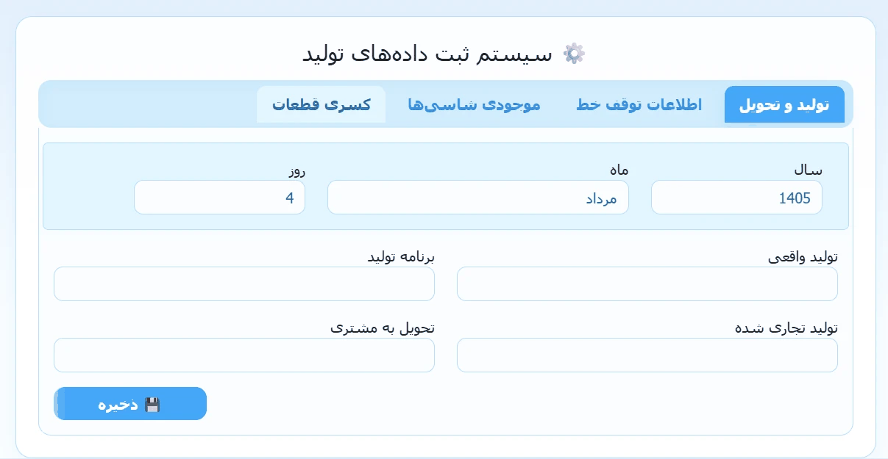
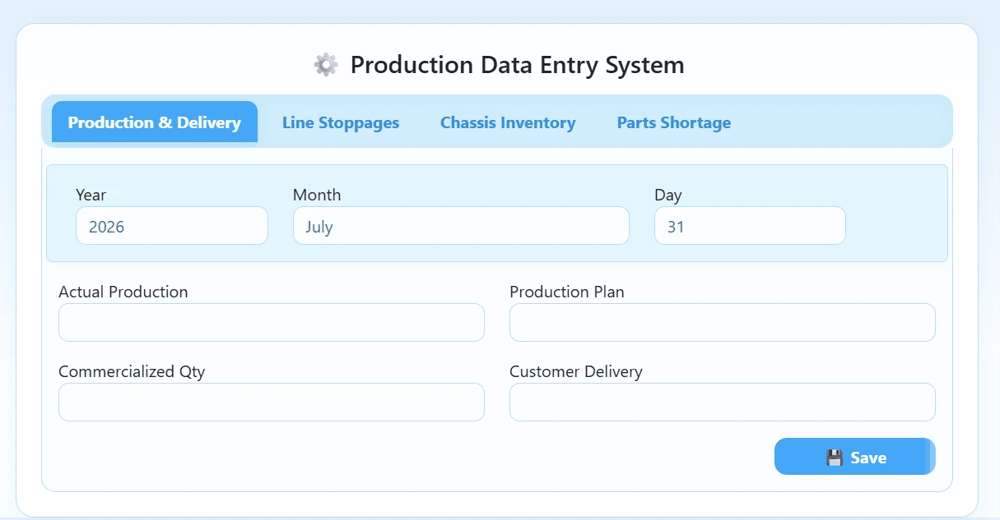

# Industrial Intelligence Platform: Factory Production & Inventory Control

A web-based production data collection and inventory management system designed for real manufacturing operations.  
This project was built to transform fragmented shop-floor records into a structured operational platform that supports production visibility, stoppage tracking, inventory control, and data-driven monitoring.

It combines **industrial engineering logic**, **data analysis methodology**, and **software engineering implementation** to solve a practical manufacturing problem through a full prototype-to-deployment workflow.

---

## Overview

In many factory environments, critical production and inventory data are still captured through disconnected spreadsheets, handwritten logs, or informal communication between departments. While those methods may appear workable in the short term, they create persistent operational and analytical problems:

- inconsistent data capture
- delayed reporting
- weak traceability
- difficulty identifying recurring process disruptions
- limited visibility for planners and decision-makers
- poor foundation for future analytics and optimization

This project was developed as a response to that class of problems.

The goal was not merely to build a dashboard or a data entry interface, but to design a system that could:

- organize production-related data in a structured format
- improve operational visibility across manufacturing workflows
- support monitoring of stoppages and shortages
- create cleaner records for analysis and future optimization
- translate industrial process understanding into a usable software tool

This repository therefore represents more than a coding exercise.  
It reflects a **problem-solving process** that started from a real operational need, moved through analytical prototyping, and resulted in a web-based system suitable for repeated use in a manufacturing context.

---

## Problem Context

Production planning and shop-floor monitoring depend heavily on timely, consistent, and interpretable data. In practice, however, several issues tend to appear:

- production records are entered manually and inconsistently
- line stoppages are not categorized in a reusable way
- material and chassis status are difficult to trace over time
- shortage information is scattered and hard to aggregate
- planners spend unnecessary time collecting data instead of interpreting it
- recurring operational patterns remain hidden because records are not analysis-ready

From an engineering perspective, this creates a gap between:

1. **what is happening in the factory**, and  
2. **what managers and planners can actually observe, measure, and improve**

This project was designed to reduce that gap.

---

## Solution Approach

The solution was developed in two major phases:

### Phase 1: Analytical Prototyping in Jupyter Notebook
The first version of the system was built in a notebook environment to validate the logic of the workflow before investing in a larger application structure.

This phase was useful for:

- exploring the operational problem in a flexible environment
- testing data structures and table layouts
- checking whether the workflow matched real production needs
- evaluating which fields, categories, and reporting views were meaningful
- validating that the collected information could later support analysis

The notebook phase served as a **low-friction experimental layer** where the system could evolve quickly.

### Phase 2: Flask-Based Web Application
Once the workflow and logic were validated, the solution was redesigned as a web application.

This architectural shift was necessary because notebooks are effective for analysis and prototyping, but they are not ideal for daily operational use by non-technical users. The web-based implementation made it possible to support:

- repeatable daily interaction
- structured data entry
- more stable interface behavior
- persistent storage
- better separation of concerns between logic, presentation, and execution
- a clearer path toward operational deployment

The result is a system that reflects both **analytical reasoning** and **software product thinking**.

---

## System Preview

### 1) Operational Web Application (Persian UI)

> The deployed interface is in Persian because the system was designed for real operational use in an Iranian manufacturing environment.

<p align="center">
  
</p>

### 2) Early Analytical / Prototype Version (Jupyter-Based)

> Before the web architecture was implemented, the workflow and problem logic were first modeled and validated in Jupyter Notebook as an analytical prototype.

<p align="center">
  
</p>

---

## Project Evolution

A major strength of this project is that it shows the full lifecycle of engineering problem solving rather than only the final interface.
```text
Real Production Problem
→ Workflow Observation
→ Jupyter-Based Prototype
→ Data Logic Validation
→ Application Architecture Design
→ Flask Web Implementation
→ Operational Usage Context
